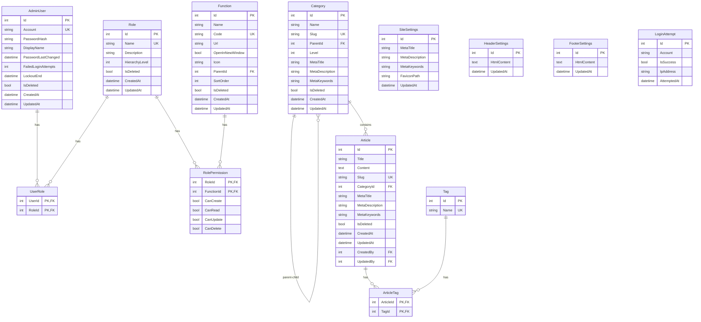

# 設計文件

## 概述

本設計文件描述網頁內容管理系統（Web CMS）的技術架構與實作細節。系統採用前後端分離架構，後端使用 ASP.NET Core 10 WebAPI（Controller-Based），前端使用 Angular 20 搭配 Bootstrap 5 實現響應式設計。

### 技術堆疊

- **後端**: ASP.NET Core 10 WebAPI (Controller-Based)
- **前端**: Angular 20
- **UI 框架**: Bootstrap 5
- **資料庫**: SQL Server / PostgreSQL
- **ORM**: Entity Framework Core
- **認證**: JWT Token
- **HTML 編輯器**: TinyMCE

## 架構

### 系統架構圖


### 分層架構


## 元件與介面

### 後端元件

#### 1. 認證模組 (Authentication Module)

```csharp
// 認證控制器介面
public interface IAuthController
{
    Task<ActionResult<LoginResponse>> Login(LoginRequest request);
    Task<ActionResult> Logout();
    Task<ActionResult<CaptchaResponse>> GenerateCaptcha();
    Task<ActionResult> ChangePassword(ChangePasswordRequest request);
}

// 認證服務介面
public interface IAuthService
{
    Task<LoginResult> ValidateCredentials(string account, string password, string captcha, string captchaToken);
    Task<bool> IsAccountLocked(string account);
    Task LockAccount(string account);
    Task UnlockAccount(string account);
    Task<int> GetFailedAttempts(string account);
    Task IncrementFailedAttempts(string account);
    Task ResetFailedAttempts(string account);
    string GenerateJwtToken(AdminUser user);
    Task<bool> ValidateCaptcha(string captcha, string token);
}

// 驗證碼服務介面
public interface ICaptchaService
{
    CaptchaResult Generate();
    bool Validate(string captcha, string token);
}
```

#### 2. 角色權限模組 (RBAC Module)

```csharp
// 角色控制器介面
public interface IRoleController
{
    Task<ActionResult<PagedResult<RoleDto>>> GetRoles(QueryParameters query);
    Task<ActionResult<RoleDto>> GetRole(int id);
    Task<ActionResult<RoleDto>> CreateRole(CreateRoleRequest request);
    Task<ActionResult<RoleDto>> UpdateRole(int id, UpdateRoleRequest request);
    Task<ActionResult> DeleteRole(int id);
}

// 權限控制器介面
public interface IPermissionController
{
    Task<ActionResult<List<PermissionDto>>> GetPermissions(int roleId);
    Task<ActionResult> SetPermissions(int roleId, SetPermissionsRequest request);
    Task<ActionResult<List<FunctionPermissionDto>>> GetFunctionPermissions(int roleId);
}

// 角色服務介面
public interface IRoleService
{
    Task<PagedResult<Role>> GetRolesAsync(QueryParameters query);
    Task<Role> GetRoleByIdAsync(int id);
    Task<Role> CreateRoleAsync(CreateRoleRequest request);
    Task<Role> UpdateRoleAsync(int id, UpdateRoleRequest request);
    Task SoftDeleteRoleAsync(int id);
    Task HardDeleteRoleAsync(int id);
}

// 權限服務介面
public interface IPermissionService
{
    Task<List<Permission>> GetPermissionsByRoleAsync(int roleId);
    Task SetPermissionsAsync(int roleId, List<PermissionSetting> permissions);
    Task<bool> HasPermissionAsync(int userId, string functionCode, PermissionType type);
}
```

#### 3. 使用者管理模組 (User Management Module)

```csharp
// 使用者控制器介面
public interface IUserController
{
    Task<ActionResult<PagedResult<UserDto>>> GetUsers(QueryParameters query);
    Task<ActionResult<UserDto>> GetUser(int id);
    Task<ActionResult<UserDto>> CreateUser(CreateUserRequest request);
    Task<ActionResult<UserDto>> UpdateUser(int id, UpdateUserRequest request);
    Task<ActionResult> DeleteUser(int id);
}

// 使用者服務介面
public interface IUserService
{
    Task<PagedResult<AdminUser>> GetUsersAsync(QueryParameters query);
    Task<AdminUser> GetUserByIdAsync(int id);
    Task<AdminUser> CreateUserAsync(CreateUserRequest request);
    Task<AdminUser> UpdateUserAsync(int id, UpdateUserRequest request);
    Task SoftDeleteUserAsync(int id);
    Task HardDeleteUserAsync(int id);
    Task<bool> IsPasswordExpired(int userId);
    Task UpdatePasswordAsync(int userId, string newPassword);
}

// 密碼驗證服務介面
public interface IPasswordValidationService
{
    ValidationResult ValidateAccount(string account);
    ValidationResult ValidatePassword(string password, string account);
    bool IsPasswordExpired(DateTime lastPasswordChange);
    bool IsSameAsCurrentPassword(string newPassword, string currentPasswordHash);
}
```

#### 4. 功能管理模組 (Function Management Module)

```csharp
// 功能控制器介面
public interface IFunctionController
{
    Task<ActionResult<PagedResult<FunctionDto>>> GetFunctions(QueryParameters query);
    Task<ActionResult<FunctionDto>> GetFunction(int id);
    Task<ActionResult<FunctionDto>> CreateFunction(CreateFunctionRequest request);
    Task<ActionResult<FunctionDto>> UpdateFunction(int id, UpdateFunctionRequest request);
    Task<ActionResult> DeleteFunction(int id);
    Task<ActionResult<List<FunctionDto>>> GetMenuTree();
}

// 功能服務介面
public interface IFunctionService
{
    Task<PagedResult<Function>> GetFunctionsAsync(QueryParameters query);
    Task<Function> GetFunctionByIdAsync(int id);
    Task<Function> CreateFunctionAsync(CreateFunctionRequest request);
    Task<Function> UpdateFunctionAsync(int id, UpdateFunctionRequest request);
    Task SoftDeleteFunctionAsync(int id);
    Task HardDeleteFunctionAsync(int id);
    Task<List<Function>> GetMenuTreeAsync(int userId);
}
```

#### 5. 文章分類模組 (Category Module)

```csharp
// 分類控制器介面
public interface ICategoryController
{
    Task<ActionResult<PagedResult<CategoryDto>>> GetCategories(QueryParameters query);
    Task<ActionResult<CategoryDto>> GetCategory(int id);
    Task<ActionResult<CategoryDto>> CreateCategory(CreateCategoryRequest request);
    Task<ActionResult<CategoryDto>> UpdateCategory(int id, UpdateCategoryRequest request);
    Task<ActionResult> DeleteCategory(int id);
    Task<ActionResult<List<CategoryTreeDto>>> GetCategoryTree();
}

// 分類服務介面
public interface ICategoryService
{
    Task<PagedResult<Category>> GetCategoriesAsync(QueryParameters query);
    Task<Category> GetCategoryByIdAsync(int id);
    Task<Category> CreateCategoryAsync(CreateCategoryRequest request);
    Task<Category> UpdateCategoryAsync(int id, UpdateCategoryRequest request);
    Task SoftDeleteCategoryAsync(int id);
    Task HardDeleteCategoryAsync(int id);
    Task<List<Category>> GetCategoryTreeAsync();
    Task<int> GetCategoryDepth(int categoryId);
    Task<bool> CanAddChildCategory(int parentId);
}
```

#### 6. 文章管理模組 (Article Module)

```csharp
// 文章控制器介面
public interface IArticleController
{
    Task<ActionResult<PagedResult<ArticleDto>>> GetArticles(QueryParameters query);
    Task<ActionResult<ArticleDto>> GetArticle(int id);
    Task<ActionResult<ArticleDto>> CreateArticle(CreateArticleRequest request);
    Task<ActionResult<ArticleDto>> UpdateArticle(int id, UpdateArticleRequest request);
    Task<ActionResult> DeleteArticle(int id);
}

// 文章服務介面
public interface IArticleService
{
    Task<PagedResult<Article>> GetArticlesAsync(QueryParameters query);
    Task<Article> GetArticleByIdAsync(int id);
    Task<Article> CreateArticleAsync(CreateArticleRequest request);
    Task<Article> UpdateArticleAsync(int id, UpdateArticleRequest request);
    Task SoftDeleteArticleAsync(int id);
    Task HardDeleteArticleAsync(int id);
}
```

#### 7. 網站設定模組 (Settings Module)

```csharp
// 網站設定控制器介面
public interface ISiteSettingsController
{
    Task<ActionResult<SiteSettingsDto>> GetSiteSettings();
    Task<ActionResult<SiteSettingsDto>> UpdateSiteSettings(UpdateSiteSettingsRequest request);
    Task<ActionResult> UploadFavicon(IFormFile file);
}

// 頁首設定控制器介面
public interface IHeaderSettingsController
{
    Task<ActionResult<HeaderSettingsDto>> GetHeaderSettings();
    Task<ActionResult<HeaderSettingsDto>> UpdateHeaderSettings(UpdateHeaderSettingsRequest request);
}

// 頁尾設定控制器介面
public interface IFooterSettingsController
{
    Task<ActionResult<FooterSettingsDto>> GetFooterSettings();
    Task<ActionResult<FooterSettingsDto>> UpdateFooterSettings(UpdateFooterSettingsRequest request);
}

// 設定服務介面
public interface ISettingsService
{
    Task<SiteSettings> GetSiteSettingsAsync();
    Task<SiteSettings> UpdateSiteSettingsAsync(UpdateSiteSettingsRequest request);
    Task<HeaderSettings> GetHeaderSettingsAsync();
    Task<HeaderSettings> UpdateHeaderSettingsAsync(UpdateHeaderSettingsRequest request);
    Task<FooterSettings> GetFooterSettingsAsync();
    Task<FooterSettings> UpdateFooterSettingsAsync(UpdateFooterSettingsRequest request);
}
```

### 前端元件

#### 1. 核心模組結構

```typescript
// 應用程式模組結構
src/
├── app/
│   ├── core/                    // 核心模組
│   │   ├── guards/              // 路由守衛
│   │   ├── interceptors/        // HTTP 攔截器
│   │   ├── services/            // 核心服務
│   │   └── models/              // 共用模型
│   ├── shared/                  // 共用模組
│   │   ├── components/          // 共用元件
│   │   │   ├── slide-panel/     // 側邊滑入面板
│   │   │   ├── confirm-dialog/  // 確認對話框
│   │   │   └── data-table/      // 資料表格
│   │   ├── directives/          // 共用指令
│   │   └── pipes/               // 共用管道
│   ├── features/                // 功能模組
│   │   ├── auth/                // 認證模組
│   │   ├── roles/               // 角色管理
│   │   ├── permissions/         // 權限管理
│   │   ├── users/               // 使用者管理
│   │   ├── functions/           // 功能管理
│   │   ├── categories/          // 分類管理
│   │   ├── articles/            // 文章管理
│   │   └── settings/            // 設定管理
│   └── layout/                  // 版面配置
│       ├── header/
│       ├── sidebar/
│       └── footer/
```

#### 2. 共用元件介面

```typescript
// 側邊滑入面板元件
export interface SlidePanel {
  isOpen: boolean;
  title: string;
  width: 'sm' | 'md' | 'lg' | 'xl';
  open(): void;
  close(): void;
  onClose: EventEmitter<void>;
}

// 確認對話框服務
export interface ConfirmDialogService {
  confirm(options: ConfirmOptions): Observable<boolean>;
}

export interface ConfirmOptions {
  title: string;
  message: string;
  confirmText?: string;
  cancelText?: string;
  type?: 'danger' | 'warning' | 'info';
}

// 資料表格元件
export interface DataTable<T> {
  data: T[];
  columns: ColumnDefinition[];
  pagination: PaginationConfig;
  onPageChange: EventEmitter<PageEvent>;
  onSort: EventEmitter<SortEvent>;
  onRowAction: EventEmitter<RowActionEvent<T>>;
}
```

#### 3. 認證服務介面

```typescript
// 認證服務
export interface AuthService {
  login(credentials: LoginCredentials): Observable<LoginResponse>;
  logout(): Observable<void>;
  refreshToken(): Observable<TokenResponse>;
  getCaptcha(): Observable<CaptchaResponse>;
  changePassword(request: ChangePasswordRequest): Observable<void>;
  isAuthenticated(): boolean;
  getCurrentUser(): User | null;
}

export interface LoginCredentials {
  account: string;
  password: string;
  captcha: string;
  captchaToken: string;
}

export interface LoginResponse {
  token: string;
  refreshToken: string;
  user: User;
  expiresAt: Date;
}
```

## 資料模型

### 實體關係圖



### 資料傳輸物件 (DTOs)

```csharp
// 登入請求
public record LoginRequest(
    [Required] string Account,
    [Required] string Password,
    [Required] string Captcha,
    [Required] string CaptchaToken
);

// 登入回應
public record LoginResponse(
    string Token,
    string RefreshToken,
    UserDto User,
    DateTime ExpiresAt
);

// 使用者 DTO
public record UserDto(
    int Id,
    string Account,
    string DisplayName,
    List<RoleDto> Roles,
    bool IsPasswordExpired,
    DateTime CreatedAt,
    DateTime UpdatedAt
);

// 角色 DTO
public record RoleDto(
    int Id,
    string Name,
    string Description,
    int HierarchyLevel,
    DateTime CreatedAt,
    DateTime UpdatedAt
);

// 建立角色請求
public record CreateRoleRequest(
    [Required][MaxLength(50)] string Name,
    [MaxLength(200)] string Description,
    [Required] int HierarchyLevel
);

// 權限 DTO
public record PermissionDto(
    int FunctionId,
    string FunctionName,
    string FunctionCode,
    bool CanCreate,
    bool CanRead,
    bool CanUpdate,
    bool CanDelete
);

// 功能 DTO
public record FunctionDto(
    int Id,
    string Name,
    string Code,
    string Url,
    bool OpenInNewWindow,
    string Icon,
    int? ParentId,
    int SortOrder,
    List<FunctionDto> Children
);

// 分類 DTO
public record CategoryDto(
    int Id,
    string Name,
    string Slug,
    int? ParentId,
    int Level,
    string MetaTitle,
    string MetaDescription,
    string MetaKeywords,
    List<CategoryDto> Children
);

// 建立分類請求
public record CreateCategoryRequest(
    [Required][MaxLength(20)] string Name,
    [Required] string Slug,
    int? ParentId,
    string MetaTitle,
    string MetaDescription,
    string MetaKeywords
);

// 文章 DTO
public record ArticleDto(
    int Id,
    string Title,
    string Content,
    string Slug,
    int CategoryId,
    string CategoryName,
    List<string> Tags,
    string MetaTitle,
    string MetaDescription,
    string MetaKeywords,
    DateTime CreatedAt,
    DateTime UpdatedAt,
    string CreatedByName
);

// 建立文章請求
public record CreateArticleRequest(
    [Required][MaxLength(200)] string Title,
    [Required] string Content,
    [Required] string Slug,
    [Required] int CategoryId,
    List<string> Tags,
    string MetaTitle,
    string MetaDescription,
    string MetaKeywords
);

// 網站設定 DTO
public record SiteSettingsDto(
    string MetaTitle,
    string MetaDescription,
    string MetaKeywords,
    string FaviconUrl
);

// 頁首/頁尾設定 DTO
public record HtmlSettingsDto(
    string HtmlContent,
    DateTime UpdatedAt
);

// 分頁結果
public record PagedResult<T>(
    List<T> Items,
    int TotalCount,
    int PageNumber,
    int PageSize,
    int TotalPages
);

// 查詢參數
public record QueryParameters(
    int PageNumber = 1,
    int PageSize = 10,
    string SortBy = null,
    bool SortDescending = false,
    string SearchTerm = null,
    bool IncludeDeleted = false
);
```

### 驗證規則

```csharp
// 帳號驗證器
public class AccountValidator : AbstractValidator<string>
{
    public AccountValidator()
    {
        RuleFor(x => x)
            .NotEmpty().WithMessage("帳號為必填欄位")
            .Length(6, 12).WithMessage("帳號長度必須為 6-12 字元")
            .Matches(@"[A-Z]").WithMessage("帳號必須包含至少 1 個大寫字母")
            .Matches(@"[a-z]").WithMessage("帳號必須包含至少 1 個小寫字母")
            .Matches(@"[0-9]").WithMessage("帳號必須包含至少 1 個數字");
    }
}

// 密碼驗證器
public class PasswordValidator : AbstractValidator<PasswordValidationContext>
{
    public PasswordValidator()
    {
        RuleFor(x => x.Password)
            .NotEmpty().WithMessage("密碼為必填欄位")
            .Length(6, 12).WithMessage("密碼長度必須為 6-12 字元")
            .Matches(@"[A-Z]").WithMessage("密碼必須包含至少 1 個大寫字母")
            .Matches(@"[a-z]").WithMessage("密碼必須包含至少 1 個小寫字母")
            .Matches(@"[0-9]").WithMessage("密碼必須包含至少 1 個數字")
            .Must((ctx, password) => !password.Contains(ctx.Account))
            .WithMessage("密碼不得包含帳號內容");
    }
}

// 分類名稱驗證器
public class CategoryNameValidator : AbstractValidator<string>
{
    public CategoryNameValidator()
    {
        RuleFor(x => x)
            .NotEmpty().WithMessage("分類名稱為必填欄位")
            .MaximumLength(20).WithMessage("分類名稱最多 20 字元");
    }
}

// 文章標題驗證器
public class ArticleTitleValidator : AbstractValidator<string>
{
    public ArticleTitleValidator()
    {
        RuleFor(x => x)
            .NotEmpty().WithMessage("文章標題為必填欄位")
            .MaximumLength(200).WithMessage("文章標題最多 200 字元");
    }
}
```


## 正確性屬性

*正確性屬性是一種應該在系統所有有效執行中保持為真的特性或行為——本質上是關於系統應該做什麼的正式陳述。屬性作為人類可讀規格與機器可驗證正確性保證之間的橋樑。*

### Property 1: 登入憑證驗證

*對於任何*有效的帳號、密碼及正確的驗證碼組合，系統應該成功驗證並回傳有效的 JWT Token。

**驗證: 需求 1.1**

### Property 2: 必填欄位驗證

*對於任何*包含空白必填欄位的表單提交，系統應該拒絕該請求並回傳對應欄位的必填錯誤訊息。

**驗證: 需求 1.2, 2.2, 4.7, 5.4, 6.4, 7.6**

### Property 3: 驗證碼驗證

*對於任何*錯誤的驗證碼輸入，系統應該拒絕登入請求，無論帳號密碼是否正確。

**驗證: 需求 1.5**

### Property 4: 安全錯誤訊息

*對於任何*帳號錯誤或密碼錯誤的登入嘗試，系統應該回傳相同的錯誤訊息，不透露具體是哪個欄位錯誤。

**驗證: 需求 1.6**

### Property 5: 憑證格式驗證

*對於任何*帳號或密碼字串，若長度不在 6-12 字元範圍內，或缺少大寫字母、小寫字母、數字中的任一種，系統應該拒絕該憑證。

**驗證: 需求 4.2, 4.3**

### Property 6: 密碼不含帳號驗證

*對於任何*包含帳號內容的密碼，系統應該拒絕該密碼設定。

**驗證: 需求 4.4**

### Property 7: 密碼變更不重複驗證

*對於任何*與目前密碼相同的新密碼，系統應該拒絕該密碼變更請求。

**驗證: 需求 4.6**

### Property 8: 角色階層等級

*對於任何*角色集合，系統應該正確維護階層等級的順序關係，較低等級的角色不應擁有較高等級角色的權限。

**驗證: 需求 2.3**

### Property 9: 軟刪除機制

*對於任何*被刪除的實體（角色、使用者、功能、分類、文章），系統應該保留該資料並標記為已刪除，而非實際從資料庫移除。

**驗證: 需求 2.5, 4.9, 5.6, 6.6, 7.8, 11.3**

### Property 10: CRUD 權限設定

*對於任何*功能項目，系統應該提供獨立的新增、讀取、更新、刪除四種權限設定，且每種權限可以獨立啟用或停用。

**驗證: 需求 3.1, 3.2**

### Property 11: 權限存取控制

*對於任何*使用者嘗試存取的功能，若該使用者的角色沒有對應的權限，系統應該拒絕存取並回傳權限不足的錯誤。

**驗證: 需求 3.3**

### Property 12: 權限即時生效

*對於任何*權限設定的變更，該變更應該立即影響所有擁有該角色的使用者，無需重新登入。

**驗證: 需求 3.4**

### Property 13: 分類層級限制

*對於任何*分類建立請求，若父分類已經是第 3 層，系統應該拒絕在其下建立子分類。

**驗證: 需求 6.1**

### Property 14: 分類名稱長度驗證

*對於任何*超過 20 字元的分類名稱，系統應該拒絕該分類建立或更新請求。

**驗證: 需求 6.3**

### Property 15: 分類級聯處理

*對於任何*被刪除的分類，系統應該同時處理該分類下的所有子分類及文章，確保資料一致性。

**驗證: 需求 6.7**

### Property 16: 文章標題長度驗證

*對於任何*超過 200 字元的文章標題，系統應該拒絕該文章建立或更新請求。

**驗證: 需求 7.3**

### Property 17: 文章內容無限制

*對於任何*長度的文章內容（包含 HTML 格式），系統應該能夠正確儲存並讀取，不受長度限制。

**驗證: 需求 7.4**

### Property 18: 單一記錄設定

*對於*網站設定、頁首設定、頁尾設定，系統應該限制為單一記錄，拒絕任何新增或刪除操作，僅允許更新。

**驗證: 需求 8.3, 9.2, 10.2**

### Property 19: 超級管理員永久刪除

*對於任何*已軟刪除的記錄，僅有超級管理員角色可以執行永久刪除操作，其他角色應該被拒絕。

**驗證: 需求 11.4**

## 錯誤處理

### 錯誤回應格式

```csharp
public record ErrorResponse(
    string Code,
    string Message,
    Dictionary<string, string[]> Errors = null,
    string TraceId = null
);

// 錯誤代碼定義
public static class ErrorCodes
{
    // 認證錯誤
    public const string InvalidCredentials = "AUTH_001";
    public const string AccountLocked = "AUTH_002";
    public const string InvalidCaptcha = "AUTH_003";
    public const string TokenExpired = "AUTH_004";
    public const string PasswordExpired = "AUTH_005";
    
    // 驗證錯誤
    public const string ValidationFailed = "VAL_001";
    public const string RequiredFieldMissing = "VAL_002";
    public const string InvalidFormat = "VAL_003";
    public const string MaxLengthExceeded = "VAL_004";
    
    // 權限錯誤
    public const string AccessDenied = "PERM_001";
    public const string InsufficientPermission = "PERM_002";
    
    // 資源錯誤
    public const string ResourceNotFound = "RES_001";
    public const string ResourceAlreadyExists = "RES_002";
    public const string ResourceInUse = "RES_003";
    
    // 業務邏輯錯誤
    public const string MaxCategoryDepthExceeded = "BIZ_001";
    public const string CannotDeleteWithChildren = "BIZ_002";
    public const string SingleRecordOnly = "BIZ_003";
    public const string PasswordSameAsCurrent = "BIZ_004";
    public const string PasswordContainsAccount = "BIZ_005";
}
```

### 例外處理中介軟體

```csharp
public class GlobalExceptionMiddleware
{
    public async Task InvokeAsync(HttpContext context, RequestDelegate next)
    {
        try
        {
            await next(context);
        }
        catch (ValidationException ex)
        {
            await HandleValidationException(context, ex);
        }
        catch (UnauthorizedException ex)
        {
            await HandleUnauthorizedException(context, ex);
        }
        catch (ForbiddenException ex)
        {
            await HandleForbiddenException(context, ex);
        }
        catch (NotFoundException ex)
        {
            await HandleNotFoundException(context, ex);
        }
        catch (BusinessException ex)
        {
            await HandleBusinessException(context, ex);
        }
        catch (Exception ex)
        {
            await HandleUnexpectedException(context, ex);
        }
    }
}
```

### 前端錯誤處理

```typescript
// HTTP 錯誤攔截器
@Injectable()
export class ErrorInterceptor implements HttpInterceptor {
  intercept(req: HttpRequest<any>, next: HttpHandler): Observable<HttpEvent<any>> {
    return next.handle(req).pipe(
      catchError((error: HttpErrorResponse) => {
        switch (error.status) {
          case 401:
            this.authService.logout();
            this.router.navigate(['/login']);
            break;
          case 403:
            this.notificationService.error('權限不足，無法執行此操作');
            break;
          case 404:
            this.notificationService.error('找不到請求的資源');
            break;
          case 422:
            this.handleValidationErrors(error.error);
            break;
          default:
            this.notificationService.error('發生未預期的錯誤，請稍後再試');
        }
        return throwError(() => error);
      })
    );
  }
}
```

## 測試策略

### 測試類型

本系統採用雙重測試方法：

1. **單元測試**: 驗證特定範例、邊界情況及錯誤條件
2. **屬性測試**: 驗證所有輸入的通用屬性

### 後端測試

#### 單元測試框架
- **框架**: xUnit
- **模擬**: Moq
- **斷言**: FluentAssertions

#### 屬性測試框架
- **框架**: FsCheck
- **配置**: 每個屬性測試最少執行 100 次迭代

#### 測試範例

```csharp
// 單元測試範例
public class PasswordValidationServiceTests
{
    [Fact]
    public void ValidatePassword_WithValidPassword_ReturnsSuccess()
    {
        // Arrange
        var service = new PasswordValidationService();
        var password = "Test123";
        var account = "User01";
        
        // Act
        var result = service.ValidatePassword(password, account);
        
        // Assert
        result.IsValid.Should().BeTrue();
    }
    
    [Theory]
    [InlineData("short")]
    [InlineData("nouppercase1")]
    [InlineData("NOLOWERCASE1")]
    [InlineData("NoNumbers")]
    public void ValidatePassword_WithInvalidPassword_ReturnsFailure(string password)
    {
        // Arrange
        var service = new PasswordValidationService();
        var account = "User01";
        
        // Act
        var result = service.ValidatePassword(password, account);
        
        // Assert
        result.IsValid.Should().BeFalse();
    }
}

// 屬性測試範例
// Feature: web-cms-management, Property 5: 憑證格式驗證
public class CredentialValidationPropertyTests
{
    [Property(MaxTest = 100)]
    public Property ValidCredentials_ShouldBeAccepted()
    {
        return Prop.ForAll(
            ValidCredentialGenerator(),
            credential => 
            {
                var service = new PasswordValidationService();
                var result = service.ValidatePassword(credential.Password, credential.Account);
                return result.IsValid;
            });
    }
    
    [Property(MaxTest = 100)]
    public Property InvalidCredentials_ShouldBeRejected()
    {
        return Prop.ForAll(
            InvalidCredentialGenerator(),
            credential =>
            {
                var service = new PasswordValidationService();
                var result = service.ValidatePassword(credential.Password, credential.Account);
                return !result.IsValid;
            });
    }
}

// Feature: web-cms-management, Property 9: 軟刪除機制
public class SoftDeletePropertyTests
{
    [Property(MaxTest = 100)]
    public Property SoftDeletedEntities_ShouldRemainInDatabase()
    {
        return Prop.ForAll(
            EntityGenerator(),
            entity =>
            {
                // Arrange
                var repository = CreateRepository();
                repository.Add(entity);
                
                // Act
                repository.SoftDelete(entity.Id);
                
                // Assert
                var deleted = repository.GetById(entity.Id, includeDeleted: true);
                return deleted != null && deleted.IsDeleted;
            });
    }
}

// Feature: web-cms-management, Property 13: 分類層級限制
public class CategoryDepthPropertyTests
{
    [Property(MaxTest = 100)]
    public Property CategoryAtMaxDepth_ShouldRejectChildCreation()
    {
        return Prop.ForAll(
            CategoryAtDepth3Generator(),
            parentCategory =>
            {
                var service = new CategoryService();
                var result = service.CanAddChildCategory(parentCategory.Id);
                return !result;
            });
    }
}
```

### 前端測試

#### 測試框架
- **單元測試**: Jest + Angular Testing Library
- **E2E 測試**: Cypress
- **屬性測試**: fast-check

#### 測試範例

```typescript
// 單元測試範例
describe('LoginComponent', () => {
  it('should show validation error when account is empty', () => {
    // Arrange
    const { getByRole, getByText } = render(LoginComponent);
    
    // Act
    fireEvent.click(getByRole('button', { name: '登入' }));
    
    // Assert
    expect(getByText('帳號為必填欄位')).toBeInTheDocument();
  });
});

// 屬性測試範例
// Feature: web-cms-management, Property 14: 分類名稱長度驗證
describe('Category Name Validation', () => {
  it('should reject names longer than 20 characters', () => {
    fc.assert(
      fc.property(
        fc.string({ minLength: 21, maxLength: 100 }),
        (name) => {
          const result = validateCategoryName(name);
          return !result.isValid;
        }
      ),
      { numRuns: 100 }
    );
  });
});

// Feature: web-cms-management, Property 16: 文章標題長度驗證
describe('Article Title Validation', () => {
  it('should reject titles longer than 200 characters', () => {
    fc.assert(
      fc.property(
        fc.string({ minLength: 201, maxLength: 500 }),
        (title) => {
          const result = validateArticleTitle(title);
          return !result.isValid;
        }
      ),
      { numRuns: 100 }
    );
  });
});
```

### 測試覆蓋率目標

| 測試類型 | 覆蓋率目標 |
|---------|-----------|
| 單元測試 | 80% |
| 整合測試 | 70% |
| E2E 測試 | 關鍵流程 100% |

### 屬性測試標記格式

每個屬性測試必須包含以下標記：
- **Feature**: web-cms-management
- **Property {number}**: {property_text}
- **Validates**: Requirements X.Y
